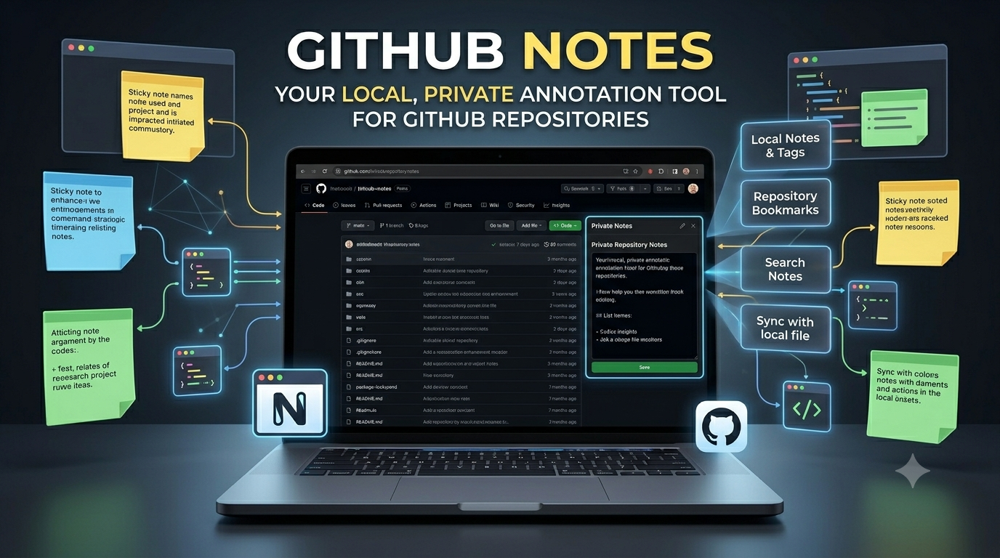

# GitHub Notes

<div align="center">


**Add private notes to GitHub repositories and review them where you actually work**

[](LICENSE)
[](https://chromewebstore.google.com/detail/github-notes/mejhlipglijbkcfcnljjdcdngafbbheo)
[](https://microsoftedge.microsoft.com/addons/detail/github-notes/kjecncpipakdbomdpagliljcaomojjbk)
[](https://github.com/zjkal/github-notes/releases)

English | [中文](README.md)

</div>

## Overview



`GitHub Notes` is a Manifest V3 browser extension for Chromium-based browsers that lets you keep private notes for GitHub repositories.

The current codebase focuses on three practical workflows:

- add and edit notes directly in repository pages
- review saved notes inside GitHub Stars pages
- search, open, export, and import notes from the popup or side panel

All data stays in the browser's local storage.

## Current Features

### 1. Inline Notes On Repository Pages

- Injects a note card into GitHub repository pages
- Opens an editor when you click the card or edit button
- Supports saving and deleting notes
- Shows the last updated time
- Handles GitHub PJAX and dynamic navigation

### 2. Notes On Stars Pages

- Displays saved notes on `/<username>?tab=stars`
- Supports custom Stars lists at `/stars/<username>/lists/<list>`
- Only injects content for repositories that already have local notes
- Lets you click a note on the Stars page to edit it directly

### 3. Popup And Side Panel Management

- Lists all saved notes
- Searches by repository name or note content
- Sorts entries by most recently updated
- Opens the related GitHub repository when you click a note item
- Can switch to side panel mode in browsers that support `sidePanel`

### 4. Data Management

- Exports all notes and extension settings as JSON
- Imports notes from a JSON backup file
- Shows note count, latest update, last backup, and last import in the options page

### 5. Additional Details

- English and Chinese localization
- Light and dark theme support
- Initializes default local settings on first install

## Supported Pages

- Repository pages: `https://github.com/<owner>/<repo>`
- Repository sub-pages such as `issues`, `pulls`, and `actions`
- Stars page: `https://github.com/<user>?tab=stars`
- Custom Stars lists: `https://github.com/stars/<user>/lists/<list>`

## Installation

### Install From Extension Stores

- Chrome: [Chrome Web Store](https://chromewebstore.google.com/detail/github-notes/mejhlipglijbkcfcnljjdcdngafbbheo)
- Edge: [Microsoft Edge Add-ons](https://microsoftedge.microsoft.com/addons/detail/github-notes/kjecncpipakdbomdpagliljcaomojjbk)

### Load In Developer Mode

1. Clone the repository

```bash
git clone https://github.com/zjkal/github-notes.git
cd github-notes
```

2. Open the browser extension page

- Chrome: `chrome://extensions/`
- Edge: `edge://extensions/`

3. Enable Developer Mode

4. Click `Load unpacked` and select this project folder

## Usage

### Add Notes On A Repository Page

1. Open any GitHub repository
2. Find the note card near the repository sidebar / About area
3. Click the card or edit button
4. Enter your note and save it

### Review Notes On A Stars Page

1. Open your Stars page or a Stars list
2. The extension renders notes for repositories that already have saved entries
3. Click a note block to edit it

### Manage Notes From The Popup

1. Click the extension icon in the browser toolbar
2. Browse all saved notes in the notes list
3. Use search to filter by repository name or keywords
4. Use the data backup tab to export or import JSON files
5. Use the settings tab or options page for basic preferences and overview data

## Privacy And Storage

- Notes are stored in `chrome.storage.local`
- No automatic uploads to external services
- Current permissions are limited to `storage`, `activeTab`, `sidePanel`, and `https://github.com/*`
- Notes are stored by full repository key, for example `owner/repo`

## Project Structure

```text
github-notes/
├── manifest.json
├── src/
│   ├── background.js
│   ├── content.js
│   ├── i18n.js
│   ├── options.js
│   └── popup.js
├── pages/
│   ├── options.html
│   └── popup.html
├── styles/
│   └── content.css
├── _locales/
│   ├── en/messages.json
│   └── zh_CN/messages.json
├── assets/
└── build.ps1
```

## Local Development

This project currently does not use a bundler. After changing source files, reload the extension in your browser to test the update.

### Development Flow

1. Edit files under `src`, `pages`, `styles`, or `_locales`
2. Go back to the browser extension manager
3. Click `Reload`
4. Refresh the relevant GitHub page and verify the behavior

### Build Release Package

A PowerShell script is included for packaging:

```powershell
.\build.ps1
```

It will:

- recreate the `release/` directory
- copy the required extension files
- generate a `github-notes-v<version>.zip` archive

## Technical Notes

- Manifest V3
- Vanilla JavaScript
- Chrome Extension APIs
- Chrome Storage API
- Chrome i18n API
- `MutationObserver` with debounced updates for GitHub's dynamic page changes

## Contributing

Issues and pull requests are welcome. Please read [CONTRIBUTING.md](CONTRIBUTING.md) before contributing.

## License

This project is released under the [MIT License](LICENSE).
